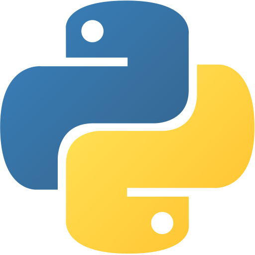

  

> ### hel&middot;lo
> */həˈlō,heˈlō/*

#

### Hi there, I'm Michael 👋

i'm a Software Engineer with a deep focus on MLOps, dedicated to building scalable systems that bring machine learning models to life.

My expertise lies in architecting the complete lifecycle of ML applications-from data pipelines and model fine-tuning to orchestrated deployment and real-time monitoring. I thrive on solving the complex challenges of deploying robust, and production-ready solutions.

  
   
  
    <i>Background GIF by <a href="https://pin.it/R5RKWyRwN">Neuda T</a> on <a href="https://www.pinterest.com/">Pinterest</a></i>
  

## 💬 Ask me about...

* Fine-tuning large-scale models (LLMs, Vision Transformers, etc.) for specific tasks.
* Building robust CI/CD pipelines for machine learning applications.
* Deploying and scaling models in production using Kubernetes & Docker.
* Architecting end-to-end MLOps solutions from the ground up.

...or anything else related to bringing machine learning model from prototype to production! Feel free to reach out.
 

---

### 💻 Technologies & Tools:

  <table border="0" cellspacing="0" cellpadding="15">
    <tr>
      <td align="center" valign="top">
        <strong>Languages & Data Science</strong>
          
        &nbsp;&nbsp;
        &nbsp;&nbsp;
        &nbsp;&nbsp;
        
      </td>
      <td align="center" valign="top">
        <strong>Backend & Web</strong>
          
        &nbsp;&nbsp;
        &nbsp;&nbsp;
        &nbsp;&nbsp;
        
      </td>
    </tr>
    <tr>
      <td align="center" valign="top">
  <strong>AI / MLOps</strong>
    
  
  
  
  
  
</td>
      <td align="center" valign="top">
        <strong>Cloud & DevOps</strong>
          
        &nbsp;&nbsp;
        &nbsp;&nbsp;
        &nbsp;&nbsp;
        
      </td>
    </tr>
  </table>

---

  <em>michaelscader</em>
   

